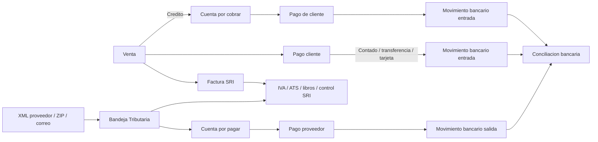

# Mapa estratégico y biblia del ecosistema OF1

Este documento resume el sistema actual y define hacia dónde debe evolucionar OF1. Debe usarse como guía viva para tomar decisiones de ventas, producto, UX, arquitectura y desarrollo.

La visión principal es que FacturaOF1 no sea solamente un sistema de facturación electrónica, sino un **ERP tributario ecuatoriano** conectado con ventas, compras, SRI, retenciones, ATS, cartera, bancos, contabilidad, firma electrónica, firmador PDF y automatización comercial.

## Vision general

OF1 Solutions se organiza como un ecosistema con cuatro frentes:

1. **OF1 Solutions**
   - Landing corporativa y puerta comercial.
   - Proyecto: `D:\Proyecto\Of1\of1solutions`
   - Promociona software a medida, IA, automatizacion, FacturaOF1 ERP, firma electronica y OF1 Firmador.

2. **FacturaOF1 ERP**
   - ERP SaaS multiempresa para Ecuador.
   - Proyecto: `D:\Proyecto\Facturacion\FacturaOf1`
   - Maneja facturacion electronica SRI, ventas, POS, clientes, inventario, proveedores, cartera, bancos, contabilidad, nomina, reportes, usuarios y suscripciones.

3. **Firma electronica**
   - Producto transaccional para vender certificados de firma electronica.
   - Ruta publica: `/solicitar-firma-electronica`
   - Maneja vigencias, precios, cupones, documentos, pago y seguimiento de solicitudes.

4. **OF1 Firmador**
   - Herramienta web/APK para firmar documentos PDF con certificado `.p12` / `.pfx`.
   - Subdominio: `firmador.of1solutions.com`
   - Incluye firma visible, validacion QR, historial y descarga.

## Mapa tecnico

### Backend

- Django + Django REST Framework.
- PostgreSQL.
- Redis + Celery.
- JWT para autenticacion.
- Multiempresa mediante empresa/workspace.
- Control de modulos por suscripcion.
- Integraciones SRI, PayPhone, email y almacenamiento local/R2/S3.

### Frontend principal

- React + Vite + Tailwind.
- Rutas publicas y privadas.
- Guards por autenticacion, rol y modulo.
- Servicios API por dominio.
- UI administrativa para ERP, firma electronica y firmador.

### APK Android

- Basado en Capacitor.
- Objetivo actual: experiencia movil para OF1 Firmador.
- Debe mantenerse como interfaz adaptada a mobile, no solo web empaquetada.

### Automatizacion

- Carpeta `automation/`.
- WhatsApp gateway.
- Workflows n8n.
- Leads comerciales.
- Base para seguimiento automatico y atencion con IA.
- Guia operativa de recuperacion: `automation/docs/n8n-session-recovery.md`.

## Principios rectores del producto

1. **El ERP debe ahorrar trabajo real**
   - Cada módulo debe reducir digitación, reproceso o incertidumbre operativa.
   - La meta no es solo registrar información, sino convertirla en decisiones y acciones.

2. **FacturaOF1 debe funcionar por ciclos**
   - Ciclo de venta: cotización -> pedido -> factura -> cobro -> contabilidad.
   - Ciclo de compra: documento recibido -> compra/gasto -> cuenta por pagar -> retención -> contabilidad.
   - Ciclo tributario: emitidos + recibidos -> IVA -> retenciones -> ATS -> declaración asistida.
   - Ciclo documental: firma electrónica -> firmador -> validación -> historial.

3. **No depender de automatizaciones frágiles**
   - No basar funciones críticas en scraping del portal del SRI.
   - Preferir XML, ZIP, correo receptor, APIs, Web Services oficiales y validación por clave de acceso.
   - Cualquier integración sensible debe cuidar credenciales, trazabilidad y seguridad.

4. **UX por rol y por intención**
   - Un comerciante quiere saber cuánto vendió, qué debe cobrar, qué stock falta y qué está pendiente con SRI.
   - Un contador quiere revisar documentos emitidos/recibidos, ATS, IVA, retenciones, libros y diferencias.
   - Un administrador quiere ver usuarios, módulos, suscripción, permisos y salud del negocio.
   - Un firmador quiere subir certificado, firmar PDF, descargar y validar sin entrar al ERP completo.

5. **Todo documento debe tener trazabilidad**
   - Factura, nota de crédito, nota de débito, retención, guía, compra, pago, cobro, asiento, XML, RIDE y autorización deben poder relacionarse.
   - El usuario debe poder responder: qué pasó, cuándo pasó, quién lo hizo, qué documento lo originó y en qué estado está.

6. **Primero robustez, luego automatización avanzada**
   - Antes de IA o automatización completa, deben existir modelos claros, estados confiables, auditoría y procesos manuales bien resueltos.
   - La IA debe asistir clasificación, sugerencias y revisión, no reemplazar controles tributarios críticos sin confirmación del usuario.

## Productos comerciales

### Producto 1: FacturaOF1 ERP

**Cliente ideal**
- Negocios ecuatorianos que facturan formalmente.
- Comercios, restaurantes, servicios, distribuidores y empresas con inventario.
- Empresas que hoy usan Excel, sistemas aislados o procesos manuales.

**Propuesta de valor**
- Facturacion electronica SRI integrada.
- POS, inventario, cartera y reportes en un solo sistema.
- Control operativo para duenos, contadores y vendedores.
- Ciclo tributario ecuatoriano: emitidos, recibidos, retenciones, ATS, declaraciones y control SRI.

**Mensaje comercial**
- "Factura, vende y controla tu negocio desde una sola plataforma."
- "ERP ecuatoriano preparado para SRI."
- "Controla tu mes tributario antes de declarar."

**Mejoras prioritarias**
- Dashboard por rol.
- Flujo cotizacion -> pedido -> factura -> cobro.
- Centro de Control SRI.
- Bandeja de documentos recibidos.
- ATS automatico.
- Liquidacion de compra.
- Libros de compras y ventas.
- Onboarding guiado.
- Correos HTML profesionales.
- Reportes gerenciales vendibles.

### Producto 2: Firma electronica

**Cliente ideal**
- Personas naturales.
- Representantes legales.
- Miembros de empresa.
- Usuarios que necesitan firmar tramites, contratos, facturas o documentos.

**Propuesta de valor**
- Solicitud guiada.
- Precios claros por vigencia.
- Seguimiento de estado.
- Pago y coordinacion simplificada.

**Mensaje comercial**
- "Solicita tu firma electronica con precio claro y seguimiento."
- "Compra tu certificado y empieza a firmar documentos."

**Mejoras prioritarias**
- Formulario limpio y directo.
- Consulta de estado en modal.
- Correos estructurados.
- Seguimiento automatico por WhatsApp.
- Cupones medibles por campana.
- Upsell directo hacia OF1 Firmador.

### Producto 3: OF1 Firmador

**Cliente ideal**
- Contadores.
- Abogados.
- Administradores.
- Empresas que firman contratos, anexos, autorizaciones y documentos PDF.
- Personas que ya compraron firma electronica.

**Propuesta de valor**
- Usar la firma electronica de forma simple.
- Firmar PDF desde web o Android.
- Validar documentos con QR.
- Mantener historial y trazabilidad.

**Mensaje comercial**
- "No solo compres tu firma, usala facilmente."
- "Firma PDFs con QR verificable."

**Mejoras prioritarias**
- Landing propia mas directa.
- Plan gratuito limitado y plan profesional.
- Plantillas de posicion de firma.
- Historial por carpetas.
- Mejor flujo mobile.
- Validacion publica mas confiable visualmente.

### Producto 4: Software, IA y automatizacion

**Cliente ideal**
- Empresas con procesos manuales.
- Empresas con atencion por WhatsApp saturada.
- Empresas con datos dispersos.
- Clientes ERP que requieren personalizacion.

**Propuesta de valor**
- Sistemas a medida.
- Chatbots.
- Automatizacion documental.
- Dashboards.
- Integraciones con ERP, WhatsApp, pagos y APIs.

**Mensaje comercial**
- "Automatizamos procesos reales, no solo hacemos paginas."
- "Conectamos tus canales, datos y decisiones."

**Mejoras prioritarias**
- Casos de uso concretos.
- Formularios por necesidad.
- CRM de leads.
- Seguimiento automatico.
- Paquetes cerrados: chatbot, dashboard, integracion, automatizacion documental.

## Modulos actuales del ERP

### Ventas

- POS.
- Cotizaciones.
- Pedidos / mesas.
- Ventas.
- Clientes.

### Facturacion electronica

- Facturas.
- Notas de credito.
- Notas de debito.
- Retenciones.
- Guias de remision.
- Liquidacion de compra pendiente.
- Secuenciales.
- Certificado digital.
- Integracion SRI.
- Centro de Control SRI en roadmap.
- Conciliacion SRI vs ERP pendiente.

### Inventario

- Productos.
- Bodegas.
- Movimientos.
- Lotes y caducidad.

### Compras

- Proveedores.
- Ordenes de compra.
- Recepciones.
- Cuentas por pagar con registro de pagos en evolucion.
- Bandeja de documentos recibidos con MVP implementado.
- Libro de compras pendiente.
- Sustento tributario por compra pendiente.

### Finanzas

- Cartera.
- Bancos.
- Contabilidad.
- Declaraciones.
- Nomina.
- Trazabilidad bancaria por origen generada desde ventas, proveedores y nomina.
- Conciliacion bancaria en evolucion.
- ATS automatico pendiente.
- Declaraciones prearmadas en evolucion.
- Libro de ventas pendiente.

### Administracion

- Empresas.
- Usuarios.
- Roles.
- Suscripciones.
- Matriz de permisos.
- Catalogo de modulos.
- Configuracion.

### Documentos

- Firmador PDF.
- Validacion publica.
- Administracion de firmador.

### Comercial interno

- Solicitudes de firma electronica.
- Precios de firma.
- Leads de automatizacion.
- Pagos online.

## Estrategia tributaria FacturaOF1

La siguiente evolución del ERP debe ir más allá de emitir comprobantes. El objetivo comercial y de producto es convertir FacturaOF1 en un **ERP tributario ecuatoriano**, capaz de conectar ventas, compras, SRI, retenciones, declaraciones, cartera, bancos y contabilidad.

### Ciclo tributario objetivo

```text
FacturaOF1
  -> SRI
      -> Comprobantes emitidos
          -> Facturas
          -> Notas de crédito
          -> Notas de débito
          -> Retenciones
          -> Guías de remisión
          -> Liquidaciones de compra
      -> Comprobantes recibidos
          -> Facturas de proveedores
          -> Notas de crédito recibidas
          -> Notas de débito recibidas
          -> Retenciones recibidas
          -> Liquidaciones recibidas
      -> Tributación
          -> IVA
          -> ATS
          -> Retenciones
          -> Libros de compras y ventas
          -> Conciliación SRI vs ERP
      -> Contabilidad y finanzas
          -> Cuentas por cobrar
          -> Cuentas por pagar
          -> Bancos
          -> Cartera
          -> Asientos contables
```

### Estado actual vs oportunidad

| Documento / proceso | Estado actual | Prioridad |
|---|---|---|
| Factura electrónica | Implementado | Fundamental |
| Nota de crédito | Implementado | Fundamental |
| Nota de débito | Implementado | Fundamental |
| Comprobante de retención | Implementado | Fundamental |
| Guía de remisión | Implementado | Fundamental |
| Liquidación de compra | Pendiente | Alta |
| Documentos recibidos del SRI | Parcial / pendiente de consolidar | Altísima |
| Anulación y documentos relacionados | En evolución | Alta |
| ATS automático | Pendiente / por validar alcance actual | Altísima |
| Declaración IVA asistida | Módulo declaraciones existe, falta integración tributaria completa | Alta |
| Declaración de retenciones | Módulo declaraciones existe, falta integración tributaria completa | Alta |
| Conciliación tributaria SRI vs ERP | Pendiente | Alta |
| Libro de compras | Derivable desde compras/documentos recibidos | Alta |
| Libro de ventas | Derivable desde facturación/ventas | Alta |
| Retenciones inteligentes | Pendiente | Media alta |

### Prioridad tributaria recomendada

1. **Bandeja de documentos recibidos del SRI**
   - Importar facturas de proveedores, notas de crédito, notas de débito, retenciones recibidas y liquidaciones.
   - Reconocer proveedor, clave de acceso, autorización, fechas, bases imponibles, IVA y totales.
   - Permitir convertir un documento recibido en compra, cuenta por pagar, gasto o asiento contable.

2. **Liquidación de compra**
   - Completar el catálogo principal de comprobantes electrónicos reconocidos por el SRI.
   - Flujo esperado: crear liquidación -> generar XML -> firmar -> enviar al SRI -> autorizar -> generar RIDE -> contabilizar -> vincular retención si aplica.

3. **Centro de Control SRI**
   - Mostrar autorizados, pendientes, rechazados, devueltos y sin enviar.
   - Mostrar ventas gravadas, ventas tarifa 0%, IVA generado, IVA compras, crédito tributario, retenciones recibidas, retenciones emitidas e IVA estimado a pagar.
   - Responder una pregunta clave del dueño o contador: "¿Cuánto voy a pagar al SRI este mes?"

4. **ATS automático**
   - Generar un resumen mensual con estado de preparación.
   - Validar errores antes de exportar.
   - Exportar XML cuando el periodo esté listo.
   - Mostrar documentos que requieren revisión.

5. **Retenciones inteligentes**
   - Sugerir porcentajes de retención según proveedor, tipo de contribuyente, concepto, IVA y reglas tributarias vigentes.
   - Mantener catálogo tributario versionado por vigencia.
   - Permitir que el usuario confirme o ajuste antes de emitir.

6. **Libros de compras y ventas**
   - Consolidar documentos por periodo.
   - Incluir bases 0%, bases gravadas, IVA, ICE, retenciones, cobrado, pendiente y estado SRI.
   - Exportar Excel, PDF y CSV.

7. **Conciliación SRI vs ERP**
   - Comparar lo registrado en FacturaOF1 contra lo que consta en SRI.
   - Detectar documentos presentes en SRI pero no en ERP, diferencias de IVA, retenciones no vinculadas, documentos no autorizados o notas de crédito sin relación clara.

8. **Declaraciones prearmadas**
   - Preparar IVA y retenciones desde ventas, compras, notas de crédito, notas de débito, retenciones y crédito tributario.
   - Mostrar el origen de cada valor para generar confianza.

### Recepción de comprobantes electrónicos recibidos

La automatización de documentos recibidos debe construirse por etapas, evitando depender como base principal del portal web del SRI cuando exista CAPTCHA, cambios de interfaz o manejo sensible de credenciales.

**Canales recomendados**

1. **Carga manual XML/ZIP**
   - El usuario descarga sus comprobantes recibidos o recibe XML de proveedores.
   - FacturaOF1 permite arrastrar XML, ZIP o reportes compatibles.
   - El sistema detecta documentos nuevos, duplicados e inconsistentes.

2. **Importación masiva SRI**
   - El usuario carga archivos descargados desde SRI en Línea.
   - FacturaOF1 procesa por periodo, tipo de documento y proveedor.
   - Útil para contadores que manejan muchas empresas.

3. **Correo receptor de la empresa**
   - Cada empresa configura un correo como `compras@empresa.com`.
   - Workers revisan adjuntos XML/PDF/ZIP mediante IMAP u OAuth.
   - Cada XML se valida, clasifica y se convierte en compra, gasto, cuenta por pagar o documento pendiente de revisión.

4. **Correo tributario OF1**
   - Cada empresa podría tener un correo propio del tipo `ruc@documentos.facturaof1.com`.
   - Los proveedores envían comprobantes a ese buzón.
   - FacturaOF1 enruta automáticamente el documento al workspace correcto.

**Flujo objetivo**

```text
Comprobante recibido
  -> detectar XML / ZIP / clave de acceso
  -> parsear comprobante SRI
  -> validar receptor contra empresa
  -> consultar autorización por clave de acceso
  -> identificar proveedor
  -> clasificar compra o gasto
  -> crear cuenta por pagar
  -> sugerir retención
  -> preparar ATS, IVA y contabilidad
```

**Arquitectura sugerida**

- `celery beat` para programar revisiones.
- Worker `check_supplier_email()` para correos configurados.
- Worker `process_incoming_xml()` para XML/ZIP.
- Worker `validate_sri_authorization()` para validar autorización.
- Worker `classify_purchase()` para sugerir proveedor, gasto, cuenta contable y sustento tributario.
- Worker `generate_tax_suggestion()` para retenciones, ATS e IVA.
- Guardar siempre el XML original como evidencia documental.

**Regla de producto**

La descarga automatizada directa desde SRI en Línea no debe ser el núcleo de la solución si depende de scraping, CAPTCHA o credenciales sensibles. La base robusta debe ser: XML recibido, ZIP importado, correo tributario y validación por clave de acceso.

### Implementación general de la Bandeja Tributaria

La Bandeja Tributaria OF1 debe ser el corazón del crecimiento tributario del ERP. Su función no es solo listar documentos, sino convertir comprobantes recibidos en procesos útiles para compras, cuentas por pagar, retenciones, ATS, IVA y contabilidad.

**Modelos principales sugeridos**

- `DocumentoRecibidoSRI`
  - Empresa/workspace.
  - Tipo de comprobante.
  - Clave de acceso.
  - Número de autorización.
  - RUC y razón social del emisor.
  - RUC y razón social del receptor.
  - Fecha de emisión.
  - Fecha de autorización.
  - Estado SRI.
  - Estado interno: recibido, validado, duplicado, requiere revisión, convertido, descartado.
  - Totales tributarios.
  - Archivo XML original.
  - Archivo RIDE/PDF si existe.

- `DocumentoRecibidoDetalle`
  - Producto, descripción o concepto.
  - Cantidad.
  - Precio unitario.
  - Descuento.
  - Base imponible.
  - IVA.
  - ICE.
  - Total.

- `DocumentoRecibidoImpuesto`
  - Código de impuesto.
  - Código de porcentaje.
  - Tarifa.
  - Base imponible.
  - Valor.

- `DocumentoRecibidoRelacion`
  - Relación con compra, gasto, cuenta por pagar, retención, asiento contable o documento relacionado.

- `ConfiguracionRecepcionComprobantes`
  - Empresa/workspace.
  - Correo receptor.
  - Método de conexión: IMAP u OAuth.
  - Última sincronización.
  - Estado de conexión.
  - Reglas de clasificación.

**Servicios backend necesarios**

- Parser XML por tipo de comprobante.
- Validador de estructura y receptor.
- Servicio de validación por clave de acceso.
- Detector de duplicados.
- Clasificador de proveedor.
- Clasificador de gasto/sustento tributario.
- Conversor a compra.
- Conversor a cuenta por pagar.
- Sugeridor de retenciones.
- Generador de resumen tributario mensual.

**Endpoints principales**

- `POST /api/documentos-recibidos/importar/`
  - Recibe XML o ZIP.
  - Procesa lote.
  - Devuelve resumen de nuevos, duplicados y errores.

- `GET /api/documentos-recibidos/`
  - Lista por empresa, periodo, proveedor, tipo, estado y monto.

- `GET /api/documentos-recibidos/{id}/`
  - Muestra XML, resumen tributario, detalle, validaciones y relaciones.

- `POST /api/documentos-recibidos/{id}/validar-sri/`
  - Consulta autorización por clave de acceso.

- `POST /api/documentos-recibidos/{id}/convertir-compra/`
  - Crea compra, gasto o cuenta por pagar después de revisión.

- `POST /api/documentos-recibidos/sincronizar-correo/`
  - Dispara revisión manual del correo configurado.

**Pantallas principales**

- Bandeja Tributaria.
- Importador XML/ZIP.
- Detalle de documento recibido.
- Revisión antes de convertir.
- Configuración de correo receptor.
- Centro de Control SRI.
- Libros de compras y ventas.
- ATS mensual.
- Conciliación SRI vs ERP.

**Estados mínimos del flujo**

```text
recibido
  -> validando
  -> validado
  -> requiere_revision
  -> convertido
  -> contabilizado
  -> incluido_en_ats
```

Estados alternos:

```text
duplicado
rechazado_por_receptor
sin_autorizacion
xml_invalido
descartado
```

**Regla UX**

El usuario nunca debe sentir que el sistema hizo cambios tributarios importantes sin revisión. La automatización puede preparar, sugerir y llenar datos, pero las acciones críticas deben confirmarse:

- Convertir en compra.
- Crear cuenta por pagar.
- Emitir retención.
- Contabilizar.
- Incluir en ATS definitivo.

### Fases de implementación técnica

**Fase 1: Base documental recibida**

- Crear modelos de documentos recibidos.
- Implementar carga XML individual.
- Implementar carga ZIP.
- Parsear factura, nota de crédito, nota de débito, retención, guía y liquidación.
- Guardar XML original.
- Detectar duplicados por clave de acceso.
- Crear pantalla de bandeja básica.

**Fase 2: Validación tributaria**

- Validar que el receptor del XML corresponda a la empresa activa.
- Consultar autorización por clave de acceso.
- Mostrar estado SRI y errores.
- Agregar bitácora de validaciones.
- Permitir reintento manual.

**Fase 3: Conversión operativa**

- Convertir documento recibido en compra o gasto.
- Crear proveedor si no existe, con confirmación.
- Crear cuenta por pagar.
- Vincular compra con XML recibido.
- Preparar retención sugerida sin emitirla automáticamente.

**Fase 4: Centro de Control SRI**

- Consolidar documentos emitidos y recibidos.
- Mostrar pendientes, rechazados, autorizados, sin enviar y duplicados.
- Calcular IVA generado, IVA compras, crédito tributario, retenciones emitidas y recibidas.
- Mostrar estimado mensual a pagar.

**Fase 5: Libros y ATS**

- Generar libro de ventas.
- Generar libro de compras.
- Validar datos faltantes para ATS.
- Crear vista mensual de preparación.
- Exportar ATS cuando el periodo esté completo.

**Fase 6: Automatización por correo**

- Configurar correo receptor por empresa.
- Procesar adjuntos XML/PDF/ZIP.
- Evitar duplicados.
- Notificar documentos nuevos o con errores.
- Crear correo tributario OF1 por empresa como producto premium.

**Fase 7: Automatización inteligente**

- Clasificar gastos según proveedor y descripción.
- Sugerir cuenta contable.
- Sugerir sustento tributario.
- Sugerir retenciones.
- Alertar inconsistencias antes del cierre mensual.

### Decisiones explícitas sobre scraping SRI

El scraping del portal SRI queda descartado como base del producto.

Puede evaluarse únicamente como herramienta temporal de investigación interna o asistencia puntual, nunca como flujo crítico del cliente, porque:

- El portal puede cambiar sin aviso.
- Puede tener CAPTCHA.
- Requiere credenciales sensibles del cliente.
- Puede generar bloqueos.
- Es difícil de monitorear y mantener.
- Puede romper el cierre tributario en fechas críticas.

La estrategia correcta es:

```text
XML / ZIP / correo receptor / correo tributario OF1
  -> parser
  -> validación por clave de acceso
  -> Bandeja Tributaria
  -> compra / CxP / retención / ATS / IVA / contabilidad
```

### Datos clave para compras y documentos recibidos

Para que ATS, IVA, libros y contabilidad salgan con menos reproceso, cada compra o documento recibido debería conservar:

- Tipo de comprobante.
- Tipo de identificación.
- RUC, cédula o pasaporte.
- Número de autorización.
- Clave de acceso.
- Fecha de emisión.
- Fecha de autorización.
- Sustento tributario.
- Tipo de gasto.
- Base 0%.
- Base gravada.
- Base no objeto de IVA.
- Base exenta.
- IVA.
- ICE.
- Retención de renta.
- Retención de IVA.
- Documento relacionado, cuando aplique.

### Propuesta comercial tributaria

Mensaje sugerido:

"FacturaOF1 administra tu ciclo tributario y operativo: ventas, compras, comprobantes electrónicos, retenciones, ATS, cartera, inventario y control de impuestos en un solo lugar."

Este posicionamiento permite vender el ERP no solo como facturador, sino como herramienta de control mensual para dueños, administradores y contadores.

### MVP recomendado del ERP tributario

El primer objetivo no debe ser construir todo el sistema tributario completo, sino entregar una primera versión vendible y útil para contadores y empresas.

**MVP funcional**

- Bandeja de documentos recibidos.
- Importación XML individual.
- Importación ZIP.
- Validación de duplicados.
- Validación de receptor.
- Resumen del documento recibido.
- Conversión manual a compra o gasto.
- Creación de cuenta por pagar.
- Vinculación del XML original con la compra.
- Reporte básico de compras por periodo.

**MVP comercial**

- Mensaje: "Importa tus XML y arma tus compras sin digitar todo de nuevo".
- Cliente ideal inicial: contador o empresa con muchas facturas de proveedores.
- Beneficio visible: menos digitación, menos errores y documentos listos para revisión tributaria.

**MVP UX**

- Una bandeja simple con filtros por periodo, proveedor, tipo, estado y monto.
- Botón principal: `Importar XML/ZIP`.
- Estados visuales: nuevo, duplicado, requiere revisión, validado, convertido.
- Vista de detalle con XML, resumen, impuestos y acción `Convertir en compra`.
- Nada debe contabilizarse ni emitirse automáticamente sin confirmación.

**Después del MVP**

- Validación SRI por clave de acceso.
- Correo receptor por empresa.
- Retenciones sugeridas.
- Libro de compras.
- Centro de Control SRI.
- ATS.
- Conciliación SRI vs ERP.
- Correo tributario OF1 por empresa.

### Matriz de prioridad para desarrollo

| Prioridad | Bloque | Motivo | Resultado esperado |
|---|---|---|---|
| 1 | Importador XML/ZIP | Ahorra digitación desde el primer uso | Documentos recibidos cargados en lote |
| 2 | Bandeja Tributaria | Ordena el trabajo del contador | Control por estado, periodo y proveedor |
| 3 | Conversión a compra/CxP | Conecta SRI con operación real | Compra y cuenta por pagar creadas desde XML |
| 4 | Validación por clave de acceso | Genera confianza documental | Documento confirmado contra autorización SRI |
| 5 | Centro de Control SRI | Da visión mensual al dueño/contador | IVA, retenciones y pendientes visibles |
| 6 | Libros compras/ventas | Facilita revisión y exportación | Reportes tributarios por periodo |
| 7 | ATS | Producto muy vendible para contadores | Periodo tributario preparado para revisión |
| 8 | Correo receptor | Automatiza recepción recurrente | XML procesados sin carga manual |
| 9 | Correo tributario OF1 | Diferenciador SaaS | Recepción multiempresa ordenada |
| 10 | IA tributaria | Acelera clasificación | Sugerencias de gasto, cuenta y sustento |

### Definición de terminado para funciones tributarias

Una función tributaria no debe considerarse terminada solo porque guarda datos. Debe cumplir:

- Tiene modelo de datos claro.
- Tiene estados auditables.
- Tiene permisos por rol.
- Tiene filtros por empresa y periodo.
- Conserva XML original cuando aplica.
- Tiene trazabilidad con documentos relacionados.
- Maneja duplicados.
- Muestra errores entendibles.
- Permite revisión antes de acciones críticas.
- Tiene exportación cuando el usuario naturalmente la espera.
- Está documentada en este mapa si cambia el alcance del producto.

## Diagnostico operativo del flujo ERP

Fecha de revision: 2026-09-03.

Este diagnostico se basa en la revision del codigo actual y una consulta general de conteos de la base disponible en el entorno local. No incluye datos sensibles; solo volumenes, estados y brechas de flujo.

### Foto actual de uso

| Area | Observacion |
|---|---|
| Empresas y usuarios | Existen 4 empresas y 8 usuarios; el enfoque multiempresa ya es necesario desde permisos, filtros y reportes. |
| Ventas | Existen 96 ventas completadas por 4109.48; el flujo comercial esta activo. |
| Facturacion SRI | Existen 48 comprobantes autorizados, 7 borradores, 3 anulados, 1 enviado, 1 rechazado y 1 no autorizado; se necesita un Centro de Control SRI visible. |
| Bancos | Existen 34 movimientos por 3791.20; 21 conciliados y 13 pendientes. |
| Cartera | Existen modelos y pantallas de cuentas por cobrar, pero la base consultada tiene 0 CxC; se debe validar que venta/factura a credito genere cartera en casos reales. |
| Proveedores | Existen proveedores y CxP, pero la base consultada tiene 0 CxP y 0 pagos proveedor; el nuevo flujo documento recibido -> CxP debe probarse con XML reales. |
| Documentos recibidos | Existen 5 documentos recibidos por 253.18, todos en estado recibido; falta empujarlos a conversion, pago, libro y control tributario. |
| Automation/WhatsApp | Existen leads e interacciones; el canal comercial ya puede alimentar CRM, seguimiento y ventas asistidas. |

### Flujo financiero recomendado

El flujo correcto no es registrar todo primero en bancos. Bancos debe ser la consecuencia financiera o la conciliacion de una operacion, no el punto de partida unico.



### Regla contable-operativa

- Si entra dinero por venta contado: se registra pago y el sistema crea movimiento bancario de entrada.
- Si la venta queda a credito: se crea cuenta por cobrar; cuando el cliente paga, se registra el cobro y se crea movimiento bancario.
- Si llega factura de proveedor: entra por Bandeja Tributaria; se convierte a compra/gasto o cuenta por pagar.
- Si se paga al proveedor: se registra pago proveedor y el sistema crea movimiento bancario de salida.
- Si se carga un movimiento bancario manual: debe usarse para ajustes, saldos iniciales, comisiones, transferencias, gastos menores o movimientos no originados en ventas/compras.
- La conciliacion bancaria debe comparar banco real contra movimientos generados por el ERP y marcar diferencias.

### Brechas detectadas

1. **Cartera sin datos reales**
   - El modulo existe, pero no se observan cuentas por cobrar en la data consultada.
   - Riesgo: ventas a credito pueden no estar cerrando el ciclo venta -> CxC -> cobro -> banco.

2. **CxP recien conectado**
   - Ya existe el flujo base documento recibido -> cuenta por pagar -> pago proveedor -> banco.
   - Falta validarlo con XML reales, pagos parciales, pagos totales y notas de credito.

3. **Bancos usado como registro general**
   - El sistema permite movimientos manuales y movimientos generados.
   - Debe reforzarse visualmente el origen para que el usuario sepa si un movimiento viene de venta, proveedor, nomina o ajuste manual.

4. **Documentos recibidos todavia no llegan al cierre tributario**
   - La bandeja importa XML/ZIP y puede convertir a CxP.
   - Falta libro de compras, sustento tributario, validacion SRI por clave, retenciones sugeridas y ATS.

5. **Centro de Control SRI pendiente**
   - Hay suficientes estados de comprobantes para justificar una pantalla de control mensual.
   - Debe mostrar pendientes, rechazados, no autorizados, autorizados, IVA ventas, IVA compras, retenciones y estimado a pagar.

### Mejoras prioritarias desde el diagnostico

1. **Cerrar flujo de cartera**
   - Revisar creacion automatica de CxC desde ventas/facturas a credito.
   - Mostrar CxC vinculada desde venta y factura.
   - Registrar cobro contra CxC y generar movimiento bancario.
   - Permitir pagos parciales, anulaciones y trazabilidad.

2. **Cerrar flujo de proveedores**
   - Probar documentos recibidos convertidos a CxP con XML reales.
   - Permitir pago parcial o total desde CxP.
   - Mostrar movimiento bancario generado desde pago proveedor.
   - Manejar nota de credito como cruce contra CxP sin movimiento bancario.

3. **Reforzar bancos como conciliador**
   - Separar visualmente movimientos manuales y movimientos generados.
   - Bloquear eliminacion directa de movimientos generados desde ventas, proveedores o nomina.
   - Agregar filtros por origen: manual, venta, proveedor, nomina, transferencia, ajuste.
   - Preparar importacion de extracto bancario CSV/Excel para conciliacion futura.

4. **Convertir Bandeja Tributaria en modulo operativo**
   - Estados visibles: recibido, requiere revision, validado, convertido, pagado, incluido en libro, incluido en ATS.
   - Acciones claras: convertir a compra/gasto, crear CxP, asociar proveedor, marcar no deducible, descartar.
   - Resumen por periodo: total compras, IVA compras, documentos pendientes y duplicados.

5. **Centro de Control SRI**
   - Unificar emitidos y recibidos por periodo.
   - Mostrar alertas de comprobantes sin autorizar, rechazados, anulados o con diferencias.
   - Mostrar estimacion mensual de IVA y retenciones.

6. **Libro de compras y ventas**
   - Generar reportes desde facturas emitidas y documentos recibidos.
   - Exportar Excel/CSV/PDF.
   - Preparar datos para ATS y declaraciones.

7. **CRM y automatizacion comercial**
   - Convertir leads de WhatsApp/landing en pipeline: nuevo, contactado, interesado, demo, propuesta, cerrado.
   - Medir origen, respuesta, conversion y producto de interes.
   - Conectar firma electronica, firmador, ERP y automatizacion con seguimiento por campana.

### Decision de arquitectura

El ERP debe evolucionar con esta regla:

```text
Operacion real
  -> documento comercial o tributario
  -> cuenta por cobrar / cuenta por pagar si aplica
  -> pago o cobro
  -> movimiento bancario
  -> conciliacion
  -> reporte tributario / contable
```

Bancos no debe reemplazar ventas, compras, CxC ni CxP. Bancos debe confirmar y conciliar el movimiento de dinero.

### Proxima meta tecnica recomendada

La siguiente meta de desarrollo debe ser **cerrar el circuito financiero basico**:

1. Venta contado -> pago -> banco.
2. Venta credito -> CxC -> cobro -> banco.
3. XML proveedor -> documento recibido -> CxP -> pago proveedor -> banco.
4. Banco -> conciliacion -> reporte.

Cuando ese circuito este estable, el Centro de Control SRI, libros y ATS tendran datos confiables para crecer.

## Flujos de venta

### Flujo A: firma electronica

Landing OF1 -> solicitar firma electronica -> elegir vigencia -> aplicar cupon -> cargar datos/documentos -> pago/transferencia -> correo/WhatsApp -> crear cuenta en OF1 Firmador.

**Estrategia**
- Producto de entrada.
- Ticket bajo.
- Conversion rapida.
- Permite upsell a firmador y ERP.

### Flujo B: OF1 Firmador

Landing OF1 -> OF1 Firmador -> crear cuenta -> subir certificado -> firmar PDF -> validar QR -> guardar historial.

**Estrategia**
- Producto independiente.
- Ideal para usuarios que ya tienen certificado.
- Diferenciador con APK Android.

### Flujo C: ERP

Landing OF1 -> solicitar demo -> lead -> WhatsApp/reunion -> demo por industria -> prueba/onboarding -> suscripcion.

**Estrategia**
- Venta consultiva.
- Se debe vender por nicho y dolor operativo.
- Requiere demostracion clara.

### Flujo D: software, IA y automatizacion

Landing OF1 -> formulario software/IA -> diagnostico -> propuesta -> proyecto.

**Estrategia**
- Ticket mas alto.
- Venta basada en casos de uso.
- El ERP y firmador sirven como prueba de capacidad tecnica.

## Estrategia comercial recomendada

### Prioridad 1: usar firma electronica como producto de entrada

Motivo:
- Es simple de entender.
- Tiene precio claro.
- Requiere menos demo.
- Genera base de clientes.
- Abre puerta al firmador y al ERP.

Acciones:
- Campana "Firma electronica desde $8".
- Cupon de primera compra.
- Seguimiento automatico por WhatsApp.
- Email final con CTA al firmador.
- Pagina de estado con recomendacion de usar OF1 Firmador.

### Prioridad 2: convertir OF1 Firmador en producto propio

Planes sugeridos:
- Gratis: firma limitada y validacion basica.
- Profesional: historial, QR, plantillas, mas documentos.
- Empresa: usuarios, carpetas, permisos y auditoria.

Acciones:
- Landing propia del firmador.
- APK como diferencial.
- Validacion publica como elemento de confianza.
- Promocion cruzada desde correos de firma electronica.

### Prioridad 3: vender ERP por nichos

Nichos:
- Restaurantes: mesas, pedidos, POS, facturacion.
- Comercios: stock, ventas, SRI.
- Servicios profesionales: clientes, facturacion, cartera.
- Contadores: multiempresa, SRI, documentos recibidos, ATS, retenciones y reportes tributarios.

Acciones:
- Mensajes por industria.
- Demos con datos precargados.
- Plan de entrada accesible.
- Migracion asistida desde Excel.
- Mensaje tributario para contadores: "cierra compras, ventas, retenciones y ATS con menos reproceso".
- Demo por periodo mensual: documentos emitidos, recibidos, IVA estimado y pendientes SRI.

### Prioridad 4: vender automatizacion/IA como servicio premium

Acciones:
- Chatbot WhatsApp.
- Seguimiento automatico de leads.
- Recordatorios de cartera.
- Automatizacion documental.
- Dashboards gerenciales.

## Mejoras de desarrollo

### Urgentes

- Unificar correos HTML para todos los flujos.
- Corregir caracteres danados tipo `Ã`.
- Consolidar rutas/subdominios de ERP, firmador y formularios publicos.
- QA completo del APK: login, descarga, scroll, permisos, safe area.
- Revisar proveedor de email y fallback SMTP.
- Documentar y probar recuperacion de n8n/WhatsApp Gateway para evitar cortes comerciales.

### Alto impacto

- Centro de Control SRI.
- Dashboard por rol.
- Bandeja de documentos recibidos del SRI.
- Carga XML/ZIP de comprobantes recibidos.
- Correo receptor para comprobantes de proveedores.
- Correo tributario OF1 por empresa.
- Liquidacion de compra.
- ATS automatico.
- Libros de compras y ventas.
- Conciliacion SRI vs ERP.
- Retenciones inteligentes.
- Onboarding mas guiado.
- Reportes exportables mas comerciales.
- Mejor trazabilidad de pagos y solicitudes.
- CRM basico para leads de landing/WhatsApp.

### Estrategicas

- Planes separados para ERP, firma electronica y firmador.
- Cupones/campanas medibles.
- Metricas de conversion.
- Automatizacion de seguimiento.
- Auditoria de acciones criticas.
- Documentacion comercial y tecnica.

## Riesgos actuales

1. **Mensaje comercial mezclado**
   - ERP, firma, firmador, IA y software compiten en la landing.
   - Solucion: separar por intencion del visitante.

2. **Confusion entre firma electronica y firmador**
   - Firma electronica = certificado.
   - OF1 Firmador = herramienta para usar el certificado.

3. **ERP demasiado amplio para venderlo de entrada**
   - Solucion: demos y mensajes por nicho.

4. **Textos con caracteres danados**
   - Afectan confianza profesional.
   - Deben corregirse antes de campanas fuertes.

5. **Correos planos**
   - Reducen percepcion de producto serio.
   - Deben tener marca, resumen, proximos pasos y CTA.

## KPIs sugeridos

### Firma electronica

- Visitas a solicitud.
- Solicitudes iniciadas.
- Solicitudes finalizadas.
- Pagos completados.
- Uso de cupones.
- Conversion a cuenta de firmador.

### Firmador

- Registros.
- Usuarios activos.
- Documentos firmados.
- Validaciones QR.
- Descargas APK.
- Conversion a plan pago.

### ERP

- Leads de demo.
- Demos agendadas.
- Demos realizadas.
- Empresas registradas.
- Empresas activas.
- Conversion a plan pago.
- Churn mensual.
- Documentos recibidos importados.
- XML recibidos por correo.
- XML/ZIP procesados por lote.
- Documentos duplicados detectados.
- Documentos recibidos convertidos en compra o cuenta por pagar.
- Periodos ATS generados.
- Periodos tributarios cerrados.
- Rechazos SRI resueltos.
- Diferencias detectadas en conciliacion SRI vs ERP.
- Tiempo promedio de cierre mensual.

### Software/IA

- Leads calificados.
- Reuniones agendadas.
- Propuestas enviadas.
- Propuestas cerradas.
- Ticket promedio.

## Roadmap recomendado

### Fase 1: confianza y conversion

- Correos HTML.
- Limpieza de textos.
- Funnel firma -> firmador.
- Landing con CTAs separados.
- Medicion de conversion.

### Fase 2: producto firmador

- Planes de firmador.
- Mejor historial.
- Plantillas de firma.
- APK listo para Play Store.
- Validacion publica reforzada.

### Fase 3: ERP tributario por nichos

- Demos por industria.
- Dashboard por rol.
- Centro de Control SRI.
- Bandeja de documentos recibidos.
- Importación XML/ZIP de documentos recibidos.
- Validación de autorización por clave de acceso.
- Liquidacion de compra.
- ATS automatico.
- Libros de compras y ventas.
- Onboarding guiado.
- Reportes ejecutivos.

### Fase 4: automatizacion comercial y tributaria

- CRM de leads.
- WhatsApp automatizado.
- Recordatorios de pago.
- Campanas por cupon.
- Scoring de prospectos.
- Retenciones inteligentes.
- Conciliacion SRI vs ERP.
- Declaraciones prearmadas.
- Alertas tributarias mensuales.
- Correo receptor de comprobantes por empresa.
- Correo tributario OF1 tipo `ruc@documentos.facturaof1.com`.
- Clasificación automática de compras, gastos y sustentos tributarios.

## Recomendacion principal

La estrategia mas fuerte es usar **firma electronica** como puerta de entrada, porque es simple, vendible y de conversion rapida. Desde ahi se debe llevar al cliente hacia:

- OF1 Firmador, si necesita firmar documentos.
- FacturaOF1 ERP, si tiene negocio y necesita facturar/controlar.
- Automatizacion/IA, si tiene procesos manuales o atencion por WhatsApp.

El ecosistema debe venderse como una escalera:

**Firma electronica -> OF1 Firmador -> FacturaOF1 ERP -> Automatizacion/IA a medida**
